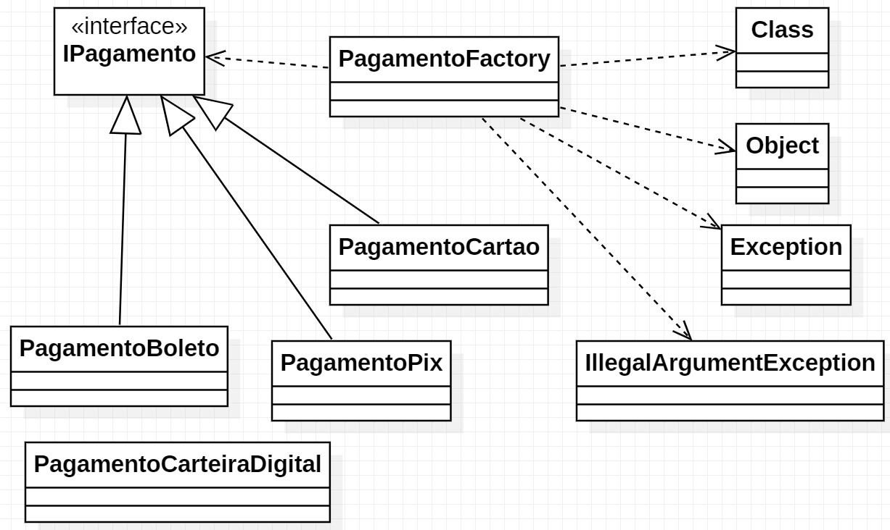

# Exercício Factory Method, Sistema de Pagamentos

#### Nome: João Vitor Fernandes Ribeiro Carneiro Ramos
#### Matrícula: 202165076C

Implementação do padrão de projeto **Factory Method** em Java

## Diagrama UML

